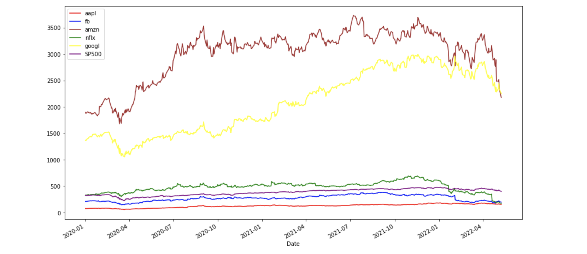
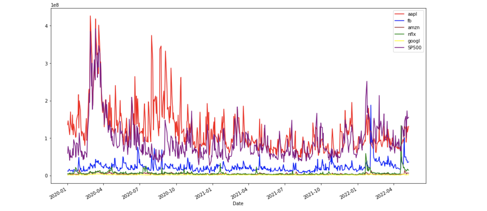
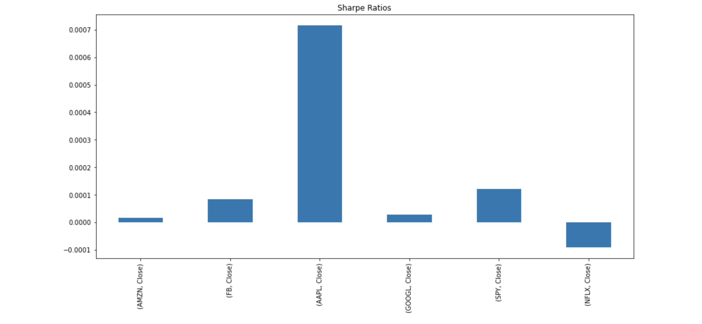
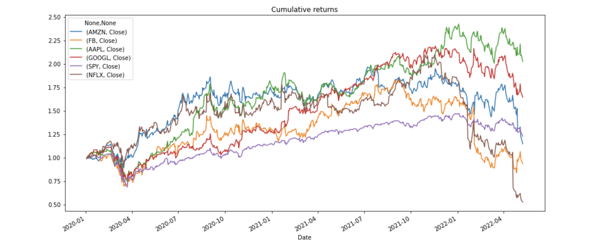
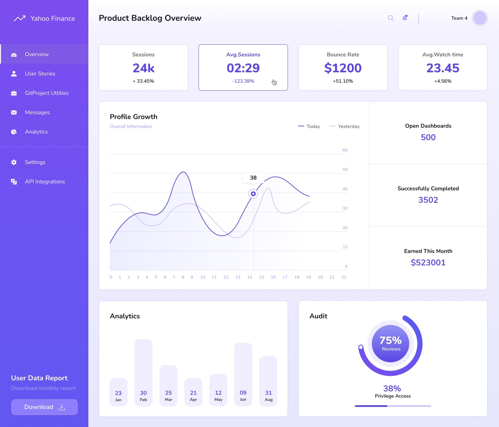

# financial_modelling_project_one
Financial Modeling Project 1

## Tools
Code is written using Python version Mac 3.10.4 and runs in a Jupyter Lab notebook. 
The following libraries are required to run this program:

- [Datetime](https://docs.python.org/3/library/datetime.html) supplies classes for manipulating dates and times.
```python
import datetime as dt
```
- The [OS](https://docs.python.org/3/library/os.html) module is used to interact with the computer's operating system.
```python
import os
```
- [Pandas](https://pandas.pydata.org/docs/) is a fast, powerful, flexible and easy to use open source data analysis and manipulation tool, built on top of the Python programming language.
```python
import pandas as pd
```
- [Requests](https://docs.python-requests.org/en/master/) Requests is an elegant and simple HTTP library for Python, built for human beings.
```python
import requests
```
- [Yahoo Finance](https://pypi.org/project/yfinance/) API is a modern platform for algorithmic trading data.
```python
import yfinance as yf
```

---
## Inatallation Guide

### Create a new conda environment to avoid conflicts with other package installations:
```powershell
conda deactivate
```
```powershell
conda update conda
```
```powershell
conda create -n pyviz python=3.10.4 anaconda
```
```powershell
conda activate pyviz
```
### Install PyViz packages:
```powershell
conda install -c plotly plotly=4.13.
```
```powershell
conda install -c pyviz hvplot
```
- PyViz require NodeJS version >= 12
```powershell
conda install -c conda-forge nodejs=12
```
### Install required JupyterLab Dependencies:
```powershell
conda install -c conda-forge jupyterlab=2
```
```powershell
jupyter labextension install jupyterlab-plotly@4.13.0 --no-build
```
```powershell
jupyter labextension install @jupyter-widgets/jupyterlab-manager plotlywidget@4.13.0 --no-build
```
```powershell
jupyter labextension install @pyviz/jupyterlab_pyviz --no-build
```
```powershell
jupyter lab build
```
### Install python-dotenv
```powershell
pip install python-dotenv
```
---
## Project Documents
[Project Charter](https://docs.google.com/document/d/1PwWpAx9TNOI1_Te6dbrxN5pMoMWYN-R-o6w_eiTE7Fg/edit?usp=sharing) is a link to a Google document.
[Project Presentation](https://docs.google.com/presentation/d/142zyyKktEoblm1tSIeBZa16DZEpnM30K_iBPf_0D8tw/edit?usp=sharing) is a link to a Google presentation. 

---
## Usage Examples

### Part 1: Collect Stock Data




### Part 2: Analyze Data


### Part 3: Product Dashboard for Yahoo Finance User Stories & Development


---
## Contributors
Initial Anthony Stallworth, Chukwuma Ochu, Ava Cazares, Yijun Liao and Gonzalo Vegas. Open Source

---
## License
None.